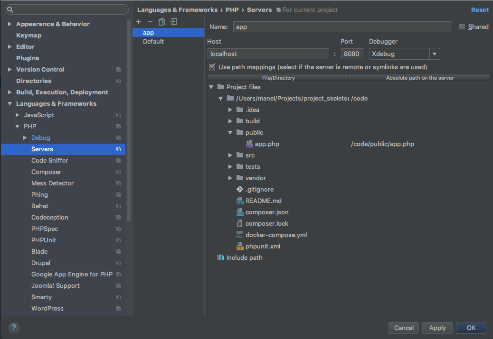
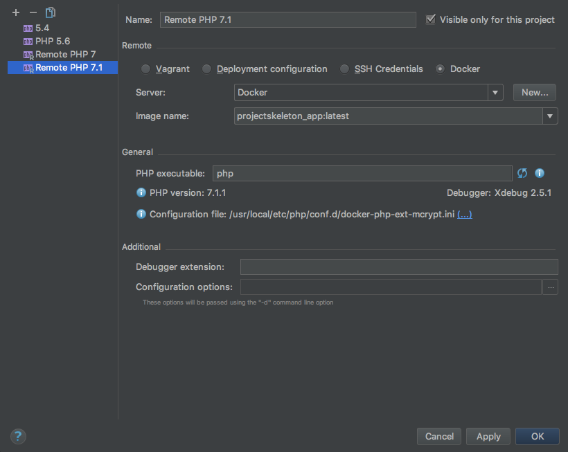
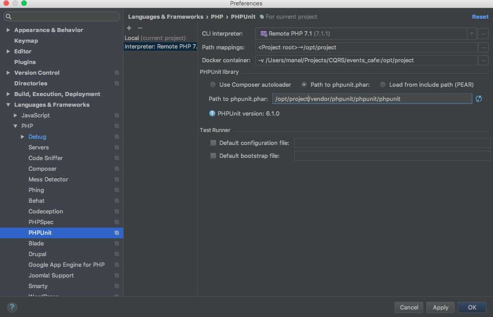

# Project Skeleton

A Skeleton project for working on

- PHP7
- Phpunit 6
- Docker
- PHPSTORM

## Create the project

    $ composer create-project --no-install malotor/skeleton my_project dev-master
    $ cd my_project

If you don´t have PHP or composer installed in your machine, you could use:

    $ docker run --rm -v $(pwd):/app composer/composer create-project --no-install malotor/skeleton my_project dev-master
    
## Setup

Edit docker-compose.yml and replace "remote_host" IP with your current IP.

    app:
        build:
            context: ./build/php
        container_name: app
        command: php -S app:80 -t public/ public/app.php
        working_dir: /code
        volumes:
            - "$PWD:/code"
        ports:
            - "8080:80"
        environment:
            APP_ENV: dev
            XDEBUG_CONFIG: remote_host=<YOUR CURRENT IP>  #Set your current IP here
            PHP_IDE_CONFIG: serverName=app

## Start the project

    $ docker-compose build
    $ docker-compose run --rm composer install
    
## Run the app
    
    $ docker-compose up -d app
    
## Run a script
    
    $ sh scripts/run php bin/myscript
    
## Run the tests

    $ docker-compose up -d tests
    $ sh scripts/phpunit --converage-html ./coverage

    
## Web application

    http://localhost:8080

# Phpstorm Xdebug configuration

### Server config

### DBGp config

### PHP Interpreter config

### PHPUnit config

 
 
## References

- https://blog.jetbrains.com/phpstorm/2016/11/docker-remote-interpreters/
- https://www.jetbrains.com/help/phpstorm/2016.1/configuring-php-namespaces-in-a-project.html
- https://sandro-keil.de/blog/2015/10/05/docker-php-xdebug-cli-debugging/
- https://gist.github.com/chadrien/c90927ec2d160ffea9c4
- https://medium.com/@pablofmorales/xdebug-with-docker-and-phpstorm-786da0d0fad2
- https://mhdzaherghaibeh.name/2016/09/25/debug-your-php-with-docker-and-xdebug-from-phpstorm/
- http://binary-data.github.io/2016/06/15/running-integration-tests-phpstorm-phpunit-docker/
- http://obrown.io/2015/12/23/phpunit-docker-phpstorm.html
- https://www.jetbrains.com/help/phpstorm/2017.1/configuring-code-coverage-measurement.html
